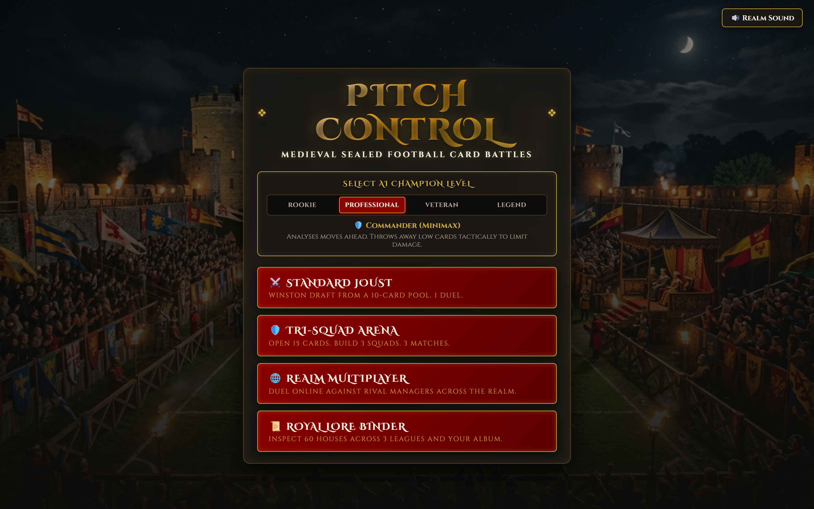
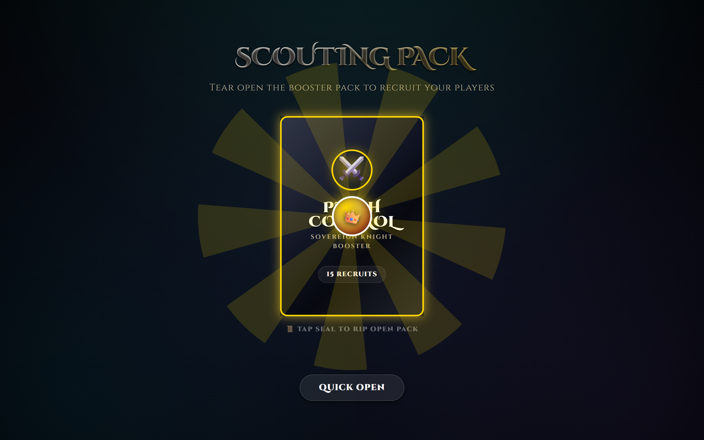
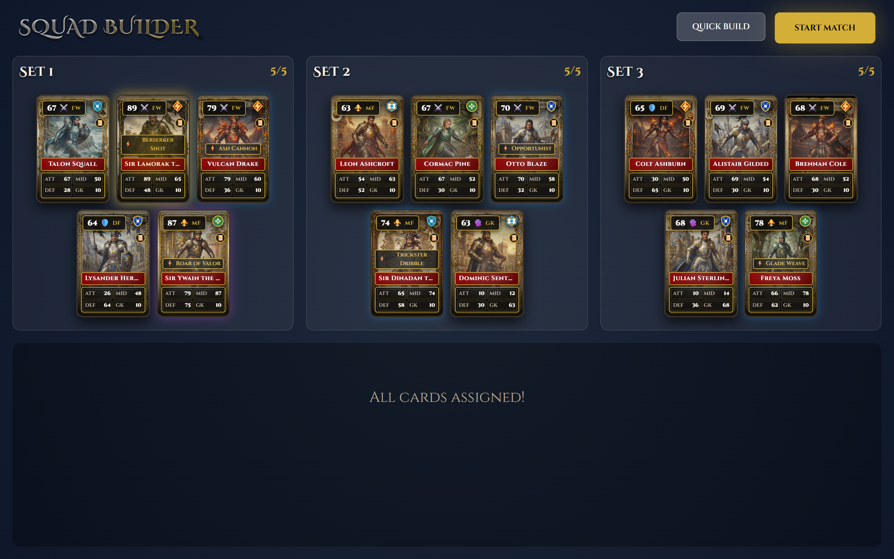
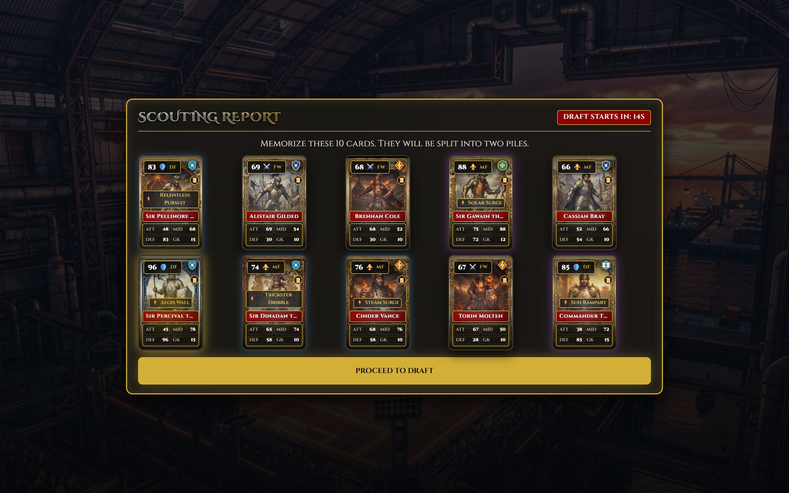
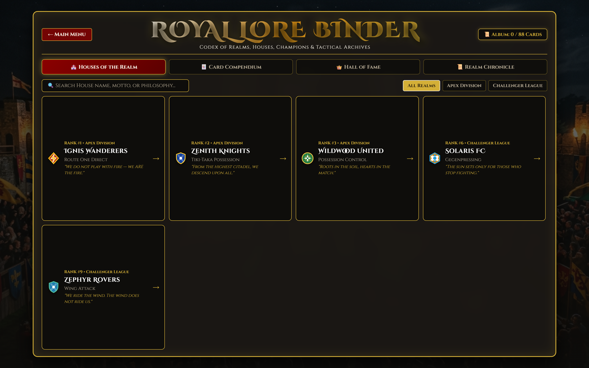
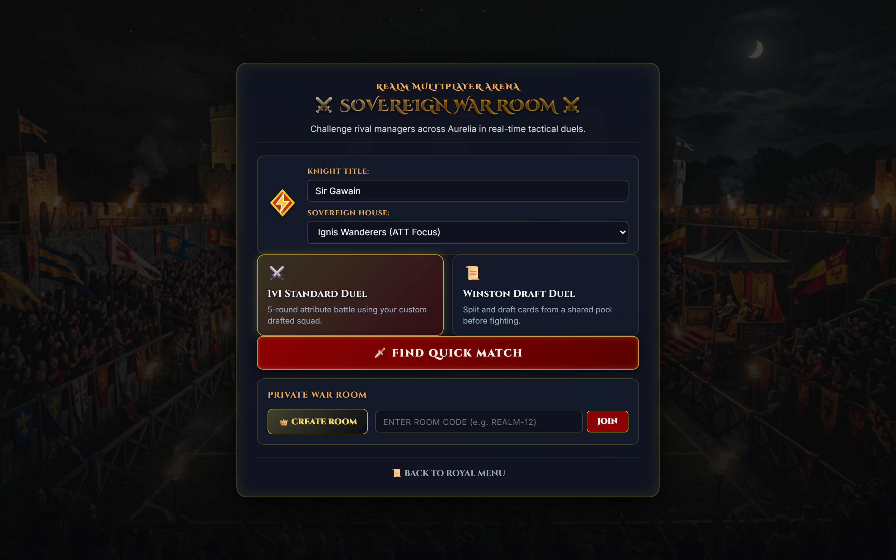

# ⚽ Pitch Control — Medieval Tactical CCG

> **A digital collectible card game hybridizing Sealed Draft mechanics with strategic football management in the world of Spatia.**

---

## 🌟 Game Overview

**Pitch Control** is a sealed-duel tactical card game set in **Spatia**—a world where militarized kinetic conflicts were replaced by holographic football battles following the **Lex Calibrata of 1880**.

Unlike traditional pay-to-win collectible card games (CCGs) or constructed deck builders, every match in Pitch Control starts fresh with a newly generated booster pack pool. Players draft squads in real-time (Winston Draft / Tri-Squad), resolve 5-round tactical duels governed by the **Match Die**, and execute high-level mitigation strategies against 4 distinct AI Champion algorithms or rival online managers.

---

## 📸 Interface & Feature Gallery

### 1. Main Menu & AI Champion Selection
Select your challenge level ranging from **Knight Rookie** (Greedy Heuristic) to **Sovereign Legend** (ISMCTS AI). Choose between **Standard Joust**, **Tri-Squad Arena**, **Realm Multiplayer**, and the **Royal Lore Binder**.



---

### 2. Sealed Scouting Pack Opening
Experience dopamine-rich 3D foil pack tearing, wax seal opening, and dynamic card reveals with rarity glow effects (Common, Rare, Elite, Legend).

| Sealed Wax Booster Pack | Dynamic Recruits Reveal Grid |
| :---: | :---: |
|  |  |

---

### 3. Tri-Squad Builder
Distribute your 15 recruited player cards across 3 specialized tactical squads (Set 1, Set 2, Set 3). Balance your Attackers, Midfielders, Defenders, and Sweeper Keepers to maximize chemistry and positional strength.



---

### 4. Tactical Match Engine (Live Duel Pitch)
Engage in 1v1 turn-based duels on the holographic grass pitch. The **Match Die** determines the active contested attribute (**ATTACK**, **MIDFIELD**, **DEFENSE**, or **GOALKEEPER**). Play cards face-down to bluff your opponent and deploy game-changing Strategy Cards.


---

### 5. Standard Joust (Winston Draft Mode)
A fast-paced 1v1 draft from a shared 10-card pool. Master the **I-Split-You-Choose** mechanic where self-balancing decisions dictate your competitive deck.



---

### 6. Royal Lore Binder & Compendium
Explore Spatia's 60 iconic football houses across 3 tiers (**Apex Division**, **Challenger League**, **Foundation Shield**), study the 6 sacred tactical philosophies, read the official chronicle chapters, and inspect your unlocked album cards.



---

### 7. Realm Multiplayer Lobby
Connect via real-time Socket.io websockets to host or join room lobbies with secret realm passcodes and duel online managers across the globe.



---

## ⚙️ Core Mechanics & Sealed Duel Engine

### 1. Winston Draft (I-Split-You-Choose)
- **Shared Card Pool**: 10 cards generated with weighted probabilities (70% Common, 20% Rare, 9% Elite, 1% Legend).
- **Self-Balancing Division**: Player 1 splits the pool into two 5-card piles. Player 2 chooses their preferred pile, leaving the remaining set to Player 1.

### 2. 5-Round Match Flow & Context Generator
- **The Match Die (d6)**:
  - `1-2` -> **ATTACK (ATT)**: Strikers & Wingers excel.
  - `3-4` -> **MIDFIELD (MID)**: Control & Vision battle.
  - `5` -> **DEFENSE (DEF)**: Tackles & Stoic clearances.
  - `6` -> **GOALKEEPER (GK)**: Direct shot on goal!
- **Simultaneous Face-Down Play**: Players select cards hiddenly to support bluffing and resource management.
- **Resolution**: High score takes the goal; ties block the shot.

---

## 🧮 Spatian Mathematical Ecosystem (STC Standards)

### Total Stat Budget (TSB) Architecture
| Card Rarity | Total Stat Budget (TSB) |
| :--- | :--- |
| **Common** | 180 Points |
| **Rare** | 210 Points |
| **Elite** | 240 Points |
| **Legend** | 270 Points |

### Positional Stat Weighting Guidelines
- **Strikers (FW)**: 50% TSB allocated to **ATT**.
- **Defenders (DF)**: 50% TSB allocated to **DEF**.
- **Midfielders (MF)**: 40-45% TSB allocated to **MID**, 30% to ATT, 30% to DEF.
- **Goalkeepers (GK)**: Concentrated GK stat + nominal outfield baselines.

### The Sweeper Keeper Protocol ("Last Line of Defense")
When a Goalkeeper card is played on a **DEFENSE (DEF)** die roll, it triggers the Sweeper Keeper Protocol:
$$\text{Final Defensive Value} = \text{DEF} + \left( \text{GK} \times 0.5 \right)$$

### Official STC Rating Formulas
$$\text{Rating}_{\text{FW}} = \lfloor \text{ATT} \times 0.6 + \text{MID} \times 0.4 \rfloor$$
$$\text{Rating}_{\text{DF}} = \lfloor \text{DEF} \times 0.6 + \text{MID} \times 0.4 \rfloor$$
$$\text{Rating}_{\text{MF}} = \lfloor \text{MID} \times 0.5 + \text{ATT} \times 0.25 + \text{DEF} \times 0.25 \rfloor$$
$$\text{Rating}_{\text{GK}} = \text{GK Stat}$$

---

## 🤖 AI Champions & Decision Algorithms

Pitch Control features 4 distinct AI difficulty levels engineered for imperfect-information card games:

1. **⚔️ Knight Rookie (Level 1)**: *Greedy Heuristic* ($O(1)$) — Plays the highest matching stat for the current round.
2. **🛡️ Commander (Level 2)**: *Minimax with Alpha-Beta Pruning* — Simulates 2 rounds ahead, discarding low-value cards tactically to limit damage.
3. **⚜️ Grandmaster (Level 3)**: *Bayesian Inference & Card Counting* — Remembers the initial draft pool to calculate opponent hand probabilities.
4. **👑 Sovereign Legend (Level 4)**: *Information Set Monte Carlo Tree Search (ISMCTS)* — Simulates 1,000+ shuffles per second to execute human-like optimal play paths.

---

## 📜 The World of Spatia & 6 Tactical Philosophies

| Philosophy | Focus | Cultural Origin |
| :--- | :--- | :--- |
| **Possession Control** | `MID` | Royal Cartographers & Architects |
| **Low Block Defense** | `DEF` | Aegis Bastion Fortress Lords |
| **Gegenpressing** | `MID` | Metropolitan Neural Scientists |
| **Wing Attack & Cross** | `ATT` | High-Altitude Aviators & Coastal Wind-Riders |
| **Route One Direct** | `ATT` | Frontier Scout Guilds & Rail Garrisons |
| **Counter-Attack Press** | `DEF` | Industrial Weld-Engineers & Steam Forges |

---

## 🛠️ Technology Stack

- **Frontend**: [React 19](https://react.dev/), [Vite](https://vite.dev/), Modern Vanilla CSS (Glassmorphism UI, 3D CSS Transforms)
- **Audio Engine**: Web Audio API with procedural sound effects & dynamic crowd audio
- **Multiplayer**: [Socket.io-client](https://socket.io/), Node.js WebSockets
- **Tooling & Code Quality**: ESLint 9, Puppeteer (Automated Screenshot & Visual Testing Pipeline)

---

## 🚀 Getting Started

### Prerequisites
- [Node.js](https://nodejs.org/) (v18.0 or higher recommended)
- `npm` or `yarn`

### Installation & Local Setup

1. **Clone the Repository**
   ```bash
   git clone https://github.com/x-Kevin-Paul-x/PITCH-CONTROL.git
   cd PITCH-CONTROL
   ```

2. **Install Dependencies**
   ```bash
   npm install
   ```

3. **Start Development Server**
   ```bash
   npm run dev
   ```
   Open `http://localhost:5173` in your browser.

4. **Regenerate Screenshots (Optional)**
   ```bash
   node scripts/capture_screenshots.mjs
   ```

---

## 📄 License & Attribution

Developed with ❤️ for football simulation & strategy CCG enthusiasts.  
*Lore & Rules maintained by the Spatian Tactical Council (STC).*
